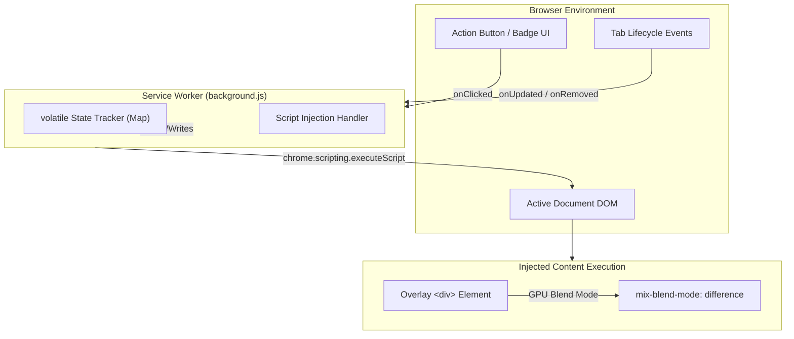
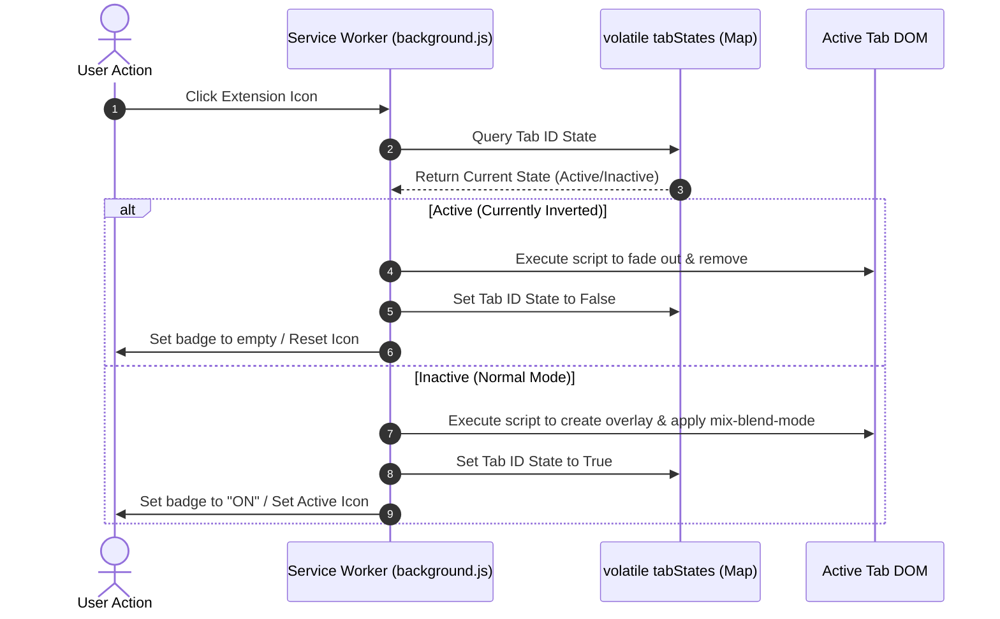

<div align="center">

# Darkument

**A production-grade, Manifest V3 browser extension engineered for high-fidelity color inversion on PDFs and web documents.**

[](https://chromewebstore.google.com/detail/darkument/bjbjmccnbbokpjlcgamnpgpphgnbjhff?authuser=2&hl=en)
[](https://microsoftedge.microsoft.com/addons/detail/darkument/hbnldmiejhccilhonmbooncolpcfhjlp)
[](https://developer.chrome.com/docs/extensions/mv3/intro/)
[](https://opensource.org/licenses/MIT)

<br />


</div>

---

## Core Purpose & Story

Bright, glaring screens pose a major challenge for late-night productivity, particularly when reading academic PDFs or reference sheets. Traditional dark mode extensions frequently break complex page layouts, consume significant CPU resources, or fail to render inside browser-embedded PDF viewer environments.

Designed and developed by **Ahmad Hassan (B-Ted)**, Darkument offers a lightweight, high-performance solution. Built as a gift for students, researchers, and professionals working into the early hours, it converts harsh light into comfortable dark tones without altering structural CSS rules or tracking user activity.

---

## Features

* **High-Fidelity Inversion:** Utilizes GPU-accelerated CSS blend modes for instant color shifting without structural layout breaking.
* **Native PDF Integration:** Works inside the browser's native PDF viewer, supporting both local (`file://`) and remote document URLs.
* **Volatile State Management:** Remembers toggle preferences per tab. Inverting one document does not affect other active tabs.
* **Zero Privacy Footprint:** Operating 100% locally. No trackers, no telemetry, and no data collection.
* **Frictionless Setup:** Includes a minimalist onboarding guide to assist with configuring local file permissions.

---

## Architecture Overview

Darkument adheres to the modern **Chrome Extension Manifest V3** standard, employing a decoupled background service worker and content script injection model.



---

## Request Lifecycle & Data Flow

When the action button is toggled, the background script checks the volatile state map to determine the action required for the active tab.



---

## Technical Working Mechanism

### The "Difference" Strategy
Instead of parsing and modifying stylesheets, Darkument applies a **Mathematical Overlay Strategy**. The overlay elements are injected as direct children of the page body.

```text
Pixel_Final = | 255 - Pixel_Original |
```

This negation transforms white pages to black and vice-versa, leaving medium grays and midtones relatively stable to preserve structural legibility.

### PDF & Local Document Injection
Browsers render PDFs using internal HTML5 parsers (such as PDF.js). Because these documents are exposed within the standard web frame DOM, the service worker is able to inject negation overlays directly into local document frames once the user has allowed local file access.

---

## Repository Structure

```text
Darkument/
├── src/                  # Extension source code
│   ├── background.js     # Volatile state service worker
│   ├── manifest.json     # Manifest V3 extension configuration
│   ├── icons/            # Action and badge visual assets
│   └── pages/            # Onboarding and documentation views
│       ├── thankyou.html # Local file permissions guide
│       └── thankyou.js   # Dynamic permission listener
├── assets/               # Brand and web store promo banners
├── build/                # Production release ZIP artifacts
├── docs/                 # Architectural specifications
└── .github/              # Issue and support configurations
```

---

## Installation

### Google Chrome (Recommended)
The extension can be installed directly from the Chrome Web Store:
**[Download on Chrome Web Store](https://chromewebstore.google.com/detail/darkument/bjbjmccnbbokpjlcgamnpgpphgnbjhff?authuser=2&hl=en)**

### Microsoft Edge
The extension can be installed directly from Microsoft Edge Addons:
**[Download on Microsoft Edge Addons](https://microsoftedge.microsoft.com/addons/detail/darkument/hbnldmiejhccilhonmbooncolpcfhjlp)**

### Manual Installation (Developer Mode)
1. Download the latest source package from the [Releases page](https://github.com/Ahmad-Hassan-0/Darkument/releases).
2. Open `chrome://extensions` or `edge://extensions` in the browser.
3. Toggle **Developer Mode** on in the upper-right corner.
4. Click **Load Unpacked** and select the `/src` directory of the project.

---

## Development & Build Pipeline

### Prerequisites
- Node.js installed locally.
- Windows PowerShell or compatible shell environments.

### Package Configuration
Scripts are managed using the package configuration file:

| Command | Action | Platform |
|---|---|---|
| `npm run build` | Compiles the files from `src/` into a release `.zip` archive inside `build/` | PowerShell |
| `npm run clean` | Deletes any compiled `.zip` archives within the `build/` folder | Bash/PowerShell |

---

## Contributing

Contributions that optimize GPU rendering, expand compatibility, or enhance the accessibility features are highly valued.

1. Fork the project.
2. Create a feature branch (`git checkout -b feature/AmazingFeature`).
3. Commit the changes (`git commit -m 'feat: add some AmazingFeature'`).
4. Push to the branch (`git push origin feature/AmazingFeature`).
5. Open a Pull Request.

---

<p align="center">
  Designed and maintained by <a href="https://github.com/AhmadHassan-BTed"><strong>Ahmad Hassan (B-Ted)</strong></a>
</p>
